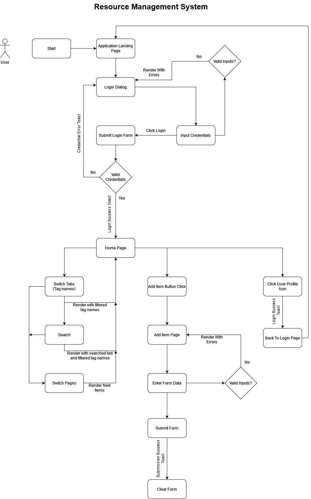

## Resource Management Admin Portal
**Check hosted version [here](https://rpsingh0.github.io/AdminPortal/)**

A simple application build with ReactJs, Redux, React-Toastify, StyledComponents, HTML and CSS

### Architecture Diagram

### Site Screenshots

#### Login page

#### Login page validations

#### Home Page

#### Search Results

#### No Search Results

#### Add Item Page

#### Add Item Page Validations

#### Add Item Page Success

#### User logout
